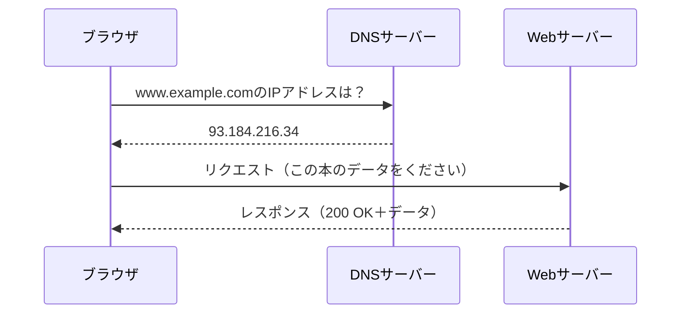
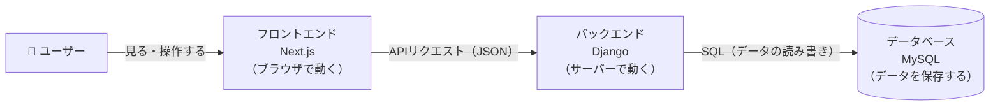
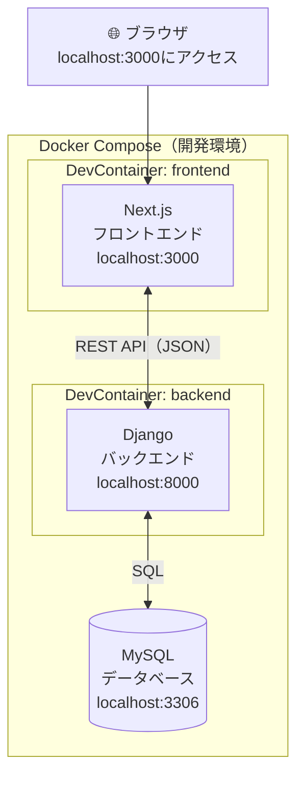

# Chapter 1：Webシステムの仕組み

コードを書く前に、まずWebがどのような仕組みで動いているかを理解しておきましょう。

ブラウザにURLを入力してからページが表示されるまでの間、裏では様々なやりとりが起きています。この仕組みを最初に把握しておくと、後の実装が「なぜそう書くのか」という理由とともに頭に入りやすくなります。

## 1-1 URLとリクエストの流れ

### URLの構造

Webにアクセスするときに入力するURLは、いくつかのパーツで構成されています。

```
https://www.example.com/books/123?sort=title
  ↑          ↑              ↑          ↑
プロトコル  ドメイン        パス    クエリパラメータ
```

**プロトコル**（`https://`）は、通信の方法を表します。`http` と `https` の違いは暗号化の有無です。`https` は通信内容が暗号化されるため、現在のWebサービスではほぼ `https` が使われています。

**ドメイン**（`www.example.com`）は、サーバーの住所に相当します。人間が覚えやすいように名前がついていますが、コンピュータ同士の通信では IPアドレスと呼ばれる数字の列（例：`93.184.216.34`）でサーバーを識別しています。

**パス**（`/books/123`）は、サーバー上のどのリソースにアクセスするかを示します。本書で作る図書館システムでは、`/books/123` というパスが「IDが123の本」を表すことになります。

**クエリパラメータ**（`?sort=title`）は、`?` 以降に付け加える追加情報です。検索条件や並び順などを指定するために使います。

### DNSの役割

ドメインをIPアドレスに変換する仕組みを **DNS**（Domain Name System）といいます。

ブラウザに `www.example.com` と入力しても、コンピュータ同士の通信はIPアドレスを使って行われます。そこでブラウザはまずDNSサーバーに「`www.example.com` のIPアドレスを教えてください」と問い合わせます。DNSサーバーが「`93.184.216.34` です」と答えると、ブラウザはそのIPアドレスに向けてリクエストを送ります。

電話帳に「田中さんの番号は〇〇〇-〇〇〇〇」と載っているのと同じ発想です。

### リクエストとレスポンスの流れ

WebはすべてHTTPという通信規約に基づいた**リクエスト**と**レスポンス**のやりとりで成り立っています。



ブラウザが「この情報をください」とリクエストを送り、サーバーが「わかりました、これです」とレスポンスを返す。この繰り返しがWebの基本です。ページを開くとき、ボタンをクリックするとき、フォームを送信するとき、すべてこの流れが発生しています。

## 1-2 HTTPの基本

WebのリクエストとレスポンスはすべてHTTP（HyperText Transfer Protocol）という規約に沿って行われます。

### HTTPメソッドの種類と役割

リクエストには「何をしたいか」を伝える**メソッド**があります。主なメソッドは次の4つです。

| メソッド | 役割 | 図書館システムでの例 |
|---------|------|------------------|
| GET | データを取得する | 本の一覧を表示する |
| POST | データを新規作成する | 新しい本を登録する |
| PUT | データを更新する | 本の情報を編集する |
| DELETE | データを削除する | 本を削除する |

この4つの操作（作成・読み取り・更新・削除）をまとめて **CRUD**（クラッド）と呼びます。Webアプリケーションの機能のほとんどは、このCRUDのどれかに当てはまります。Chapter 9で本の管理機能を作るとき、この4つのメソッドをすべて使います。

### ステータスコードの意味

レスポンスには「結果がどうだったか」を3桁の数字で表す**ステータスコード**が含まれます。

| コード | 意味 | 例 |
|-------|------|-----|
| 200 | OK（成功） | 本の一覧取得に成功 |
| 201 | Created（作成成功） | 新しい本の登録に成功 |
| 400 | Bad Request（リクエストに問題あり） | 必須項目が未入力 |
| 401 | Unauthorized（認証が必要） | ログインしていない状態でアクセスした |
| 404 | Not Found（見つからない） | 指定されたIDの本が存在しない |
| 500 | Internal Server Error（サーバーエラー） | サーバー側でバグが発生した |

コードの先頭の数字でおおまかな意味がわかります。**2xx は成功、4xx はクライアント（リクエスト側）の問題、5xx はサーバー側の問題**です。

Webを使っていると「404 Not Found」を見かけることがあると思います。あれは「指定されたページが存在しません」とサーバーがステータスコードで伝えているものです。

### ヘッダーとボディの役割

HTTPのリクエストとレスポンスには**ヘッダー**と**ボディ**があります。

**ヘッダー**はメタ情報を運びます。「このデータの形式は何か」「認証情報はあるか」といった付帯情報をキーと値のペアで記述します。

```
Content-Type: application/json
Authorization: Bearer eyJhbGci...
```

**ボディ**は実際のデータです。本を登録するリクエストなら、タイトルや著者名などのデータがボディに入ります。

```json
{
  "title": "実装で学ぶフルスタックWeb開発",
  "author": "山田 太郎",
  "isbn": "978-4-00-000000-0"
}
```

本書では、バックエンド（Django）がJSON形式でデータをレスポンスのボディに入れて返し、フロントエンド（Next.js）がそれを受け取って画面に表示します。このやりとりの形式を **REST API** と呼びます（詳しくはChapter 6で学びます）。

## 1-3 フロントエンド・バックエンド・DBの三層構造

Webシステムは通常、**フロントエンド**・**バックエンド**・**データベース（DB）** の3つの層に分かれて動いています。

### 各層の役割と責務



**フロントエンド**は、ユーザーが直接見て操作する部分です。ブラウザ上で動き、ボタンや入力フォームなど画面のすべてを担当します。本書ではNext.js（TypeScript）を使います。

**バックエンド**は、サーバー上で動くプログラムです。フロントエンドからリクエストを受け取り、データベースへの読み書きや、ビジネスロジックの処理（「貸出可能冊数を超えていないか」のチェック等）を担当します。本書ではDjango（Python）を使います。

**データベース**は、データを永続的に保存する場所です。プログラムを終了してもデータが消えないのはデータベースがあるからです。本書ではMySQLを使います。

### なぜ分かれているのか

一つのプログラムにすべてを詰め込むことも技術的には可能ですが、三層に分かれているのには理由があります。

**役割の分離**。フロントエンドは「どう見せるか」、バックエンドは「どう処理するか」、DBは「どう保存するか」に集中できます。それぞれの層を独立して変更・改善できるため、画面のデザインだけ変えたいときにバックエンドを触る必要がありません。

**セキュリティ**。データベースを外部から直接見えない場所に置けます。ユーザーが直接DBを操作できると、データの改ざんや漏洩のリスクが高まります。バックエンドが「門番」として間に入ることで、不正なアクセスをチェックできます。「ログインしていないユーザーには貸出データを見せない」というChapter 10の認証機能も、この構造があるからこそ実現できます。

**スケーラビリティ**。アクセスが増えたとき、ボトルネックになっている層だけをスケールアップできます。

この三層構造は本書を通じて何度も登場します。「今自分はどの層を触っているか」を意識しながら読み進めると、全体像を見失わずに学習できます。

## 1-4 図書館貸出システムの全体像

本書で作るシステムがどのような構成になるかを確認しておきましょう。

### システム構成図



開発中はすべてローカル（自分のPC）で動きます。ブラウザから `localhost:3000` にアクセスするとNext.jsの画面が表示され、そこからDjangoの `localhost:8000` に対してAPIリクエストが飛び、DjangoがMySQLからデータを読み書きします。

バックエンドとフロントエンドはそれぞれ独立したDevContainerとして動作します。Docker Composeでまとめて管理し、VSCodeウィンドウを2つ開いて開発します（Chapter 2で構築します）。

### 使用技術スタック

| 層 | 技術 | 言語 |
|----|------|------|
| フロントエンド | Next.js 15 | TypeScript |
| バックエンド | Django 5 ＋ Django REST Framework | Python |
| データベース | MySQL 8 | SQL |
| 開発環境 | VSCode ＋ DevContainer ＋ Docker Compose | − |
| 認証 | JWT（JSON Web Token） | − |
| CI/CD | GitHub Actions | YAML |

技術の詳細は各章で説明します。今は「こういう組み合わせで作るんだ」という全体像を頭に入れておけば十分です。

### 各章で作るものの概観

本書全体の流れをひとことで表すと、**「まず全層を薄く繋ぎ、その後各層を深く作り込む」**です。

Chapter 3で全層をhello worldレベルで繋いだ後、Chapter 4〜7で各層の基礎を固め、Chapter 8以降でフルスタックの機能を組み上げていきます。

| 章 | 作るもの・学ぶこと |
|----|-----------------|
| Chapter 2 | 開発環境の構築 |
| Chapter 3 | hello worldレベルで全層を繋ぐ |
| Chapter 4 | Djangoプロジェクトの基礎 |
| Chapter 5 | データベース設計とDjangoモデル |
| Chapter 6 | REST APIの実装 |
| Chapter 7 | Next.jsの基礎と画面の作成 |
| Chapter 8 | フロントエンドとバックエンドの接続 |
| Chapter 9 | 本の管理機能（CRUD）をフロントエンドで実装 |
| Chapter 10 | 認証（ログイン・ログアウト） |
| Chapter 11 | 貸出・返却機能の実装 |
| Chapter 12 | テスト |
| Chapter 13 | CI/CD |
| Chapter 14 | 本番環境の概念 |

## まとめ

- WebはHTTPによるリクエストとレスポンスのやりとりで成り立っていることを理解した
- HTTPメソッド（GET / POST / PUT / DELETE）とステータスコードの役割を理解した
- フロントエンド・バックエンド・DBの三層構造と、それぞれの役割・分ける理由を理解した
- 本書で作る図書館貸出システムの全体構成と各章の流れを把握した

---

次の章では、開発を始めるための環境を一から構築します。
