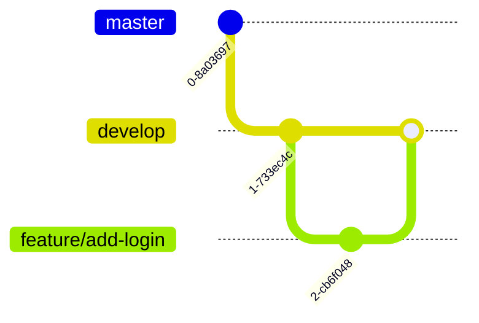
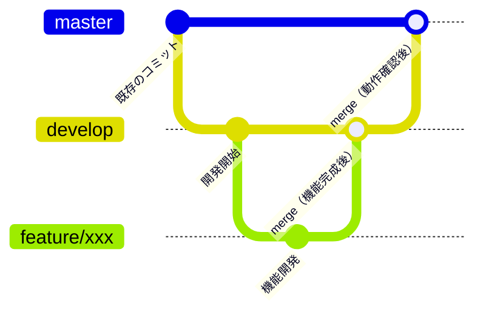

# Chapter 2：開発環境の構築

この章では、開発を始めるための環境を一から構築します。VSCodeでコードを書き、ターミナルでコマンドを実行し、Gitで変更を管理し、DockerとDevContainerで全員が同じ環境を使えるようにする。これらのツールは現代の開発現場で当たり前のように使われているものです。

最初は慣れない操作が続くかもしれませんが、Chapter 3 以降で毎日使うものです。ひとつひとつ確認しながら進めましょう。

## 2-1 VSCodeのインストールと基本操作

VSCode（Visual Studio Code）はMicrosoftが開発するコードエディタです。無料で使え、拡張機能が豊富で、現在最も広く使われているエディタのひとつです。

### 🛠️ VSCodeをインストールする

1. ブラウザで `https://code.visualstudio.com` を開く
2. **Download for Windows**（またはMacの場合は **Download for Mac**）ボタンをクリックする
3. ダウンロードしたインストーラーを実行する
4. インストール完了後、VSCodeを起動する

> **Windowsの方へ**：インストール時に「PATHへの追加」にチェックを入れてください。ターミナルから `code` コマンドでVSCodeを開けるようになります。

### 画面構成

VSCodeを起動すると、主に4つのエリアがあります。

```
+------------------+----------------------------------+
|  アクティビティ   |                                  |
|  バー            |         エディタ                  |
|                  |   コードを書く場所                 |
| [ファイル]        |                                  |
| [検索]           |   file1.py    file2.tsx  ...     |
| [Git]            |                                  |
| [拡張機能]        +----------------------------------+
|                  |         ターミナル                |
+------------------+   コマンドを実行する場所           |
| ステータスバー    +----------------------------------+
+--------------------------------------------------+
```

- **アクティビティバー**（左端）：ファイル一覧・検索・Git操作・拡張機能などの切り替えボタン
- **エクスプローラー**（左サイドバー）：プロジェクトのファイル・フォルダ構成を表示する
- **エディタ**（中央）：コードを書く場所。タブで複数ファイルを開ける
- **ターミナル**（下部）：コマンドを実行する場所。本書での操作はここで行う
- **ステータスバー**（最下部）：現在のブランチ名やエラー数が表示される

### よく使うショートカット

| 操作 | Windows | Mac |
|------|---------|-----|
| ファイルをすばやく開く | `Ctrl+P` | `Cmd+P` |
| コマンドパレット | `Ctrl+Shift+P` | `Cmd+Shift+P` |
| ターミナルを開く/閉じる | `Ctrl+@` | `Ctrl+@` |
| コメントのオン/オフ | `Ctrl+/` | `Cmd+/` |
| コードのフォーマット | `Shift+Alt+F` | `Shift+Option+F` |
| 定義へジャンプ | `F12` | `F12` |
| 文字列を一括置換 | `Ctrl+H` | `Cmd+H` |

**コマンドパレット**（`Ctrl+Shift+P` / `Cmd+Shift+P`）は特に覚えておいてください。機能名を入力するだけでほぼすべての操作にアクセスできる、VSCodeの中心的な機能です。

### 🛠️ ターミナルを複数開く

本書の開発ではターミナルを2つ同時に使います（DjangoとNext.jsをそれぞれ別のターミナルで起動するためです）。

1. メニューの **ターミナル → 新しいターミナル** でターミナルを開く
2. ターミナルパネル右上の **＋** ボタンで2つ目を追加する
3. ターミナルパネル右の一覧から切り替えられることを確認する

## 2-2 ターミナルの基本操作

### ターミナルとは

ターミナル（コマンドライン）は、コンピュータにコマンド（命令）をテキストで入力して操作するインターフェースです。GUIのような見た目はありませんが、開発ではターミナルを使う場面が多くあります。

本書での開発はDevContainerの中で行うため、WindowsでもMacでも同じ**Linux**のターミナル環境が使えます。OS間の違いを気にする必要はありません。

### 🛠️ 基本コマンドを実行する

VSCodeのターミナルを開いて、以下のコマンドを順番に試しましょう。

**現在いる場所を確認する**

```bash
pwd
```

`pwd`（print working directory）は今いるディレクトリの絶対パスを表示します。`/workspace` のようなパスが表示されます。

**ファイル・ディレクトリの一覧を表示する**

```bash
ls
```

`ls`（list）は現在のディレクトリにあるファイルやフォルダを一覧表示します。`ls -la` と打つと、隠しファイル（`.` で始まるファイル）や権限などの詳細情報も表示されます。

**ディレクトリを移動する**

```bash
cd backend
```

`cd`（change directory）はディレクトリを移動します。`cd ..` で1つ上のディレクトリに戻れます。`cd` だけ打つとホームディレクトリに戻ります。

**ディレクトリを作成する**

```bash
mkdir practice
```

`mkdir`（make directory）はディレクトリを作成します。

**一連の操作を試す**

```bash
mkdir practice
cd practice
pwd
ls
cd ..
```

### パスの概念

パスはファイルやディレクトリの住所です。2種類あります。

**絶対パス**はルート（`/`）からの完全な経路です。どこにいても同じ場所を指します。

```
/workspace/backend/config/settings.py
```

**相対パス**は現在いるディレクトリからの経路です。

```bash
# 現在 /workspace にいる場合
backend/config/settings.py

# 現在 /workspace/backend にいる場合
../frontend/src/app/page.tsx    # .. は1つ上のディレクトリを表す
```

VSCodeのエラーメッセージやコマンドの出力でパスが表示されたとき、絶対パスか相対パスかを区別する習慣をつけておきましょう。

## 2-3 Gitの概念とオーソドックスな使い方

### バージョン管理とは何か・なぜ必要か

コードを書いていると、「昨日の状態に戻したい」「2人で同時に作業したい」「いつ誰が何を変えたか確認したい」という場面が必ず来ます。

Gitがない場合、こんな状況が生まれがちです。

```
library_v1.py
library_v2.py
library_v2_final.py
library_v2_final_修正.py
library_v2_final_修正2_本番用.py
```

**Git**はこの問題を解決するバージョン管理システムです。変更の履歴を記録し、いつでも過去の状態に戻せます。複数人で同時に開発する際の変更の統合も管理します。

### Gitの基本概念

**リポジトリ**（repository）はGitが管理するプロジェクトの単位です。プロジェクトのファイルとその変更履歴がすべて含まれます。

**コミット**（commit）は変更のスナップショットです。「この時点のコードはこうだった」という記録を残す操作です。コミットにはメッセージをつけて何を変えたかを記録します。

**ブランチ**（branch）はコミットの流れを枝分かれさせる仕組みです。本番のコードに影響を与えずに新機能を開発できます。



**リモートリポジトリ**はGitHub等のサーバー上にあるリポジトリです。ローカルの変更を `push` で送信し、他のメンバーの変更を `pull` で取得します。

### 🛠️ 基本的なワークフローを実行する

Gitの基本操作を練習しましょう。練習用ディレクトリを作成してリポジトリを初期化します。

```bash
mkdir git-practice
cd git-practice
git init
```

ファイルを作成してコミットするまでの流れを試します。

```bash
# ファイルを作成する
echo "hello" > hello.txt

# 変更の状態を確認する（何が変更されているかを表示する）
git status

# ステージングエリアに追加する（コミットの対象として選ぶ）
git add hello.txt

# コミットする（変更を記録する）
git commit -m "はじめてのコミット"

# コミット履歴を確認する
git log --oneline
```

変更からコミットまでの流れをまとめると次のとおりです。

```
作業ディレクトリ ──git add──→ ステージング ──git commit──→ リポジトリ
  ファイルを編集               変更を選ぶ               記録する
```

**コミットメッセージ**は後から見て何をしたかわかる内容にしましょう。`"fix"` より `"ログイン画面のバリデーションエラーを修正する"` の方が後で役に立ちます。

次に、変更を加えてコミットを重ねてみます。

```bash
echo "world" >> hello.txt
git add hello.txt
git commit -m "worldを追加する"

# 2つのコミットが積み上がっていることを確認する
git log --oneline
```

### ブランチの概念

本書ではシンプルなブランチ戦略を使います。

| ブランチ | 役割 |
|---------|------|
| `master` | 安定したコード（本番に近い状態） |
| `develop` | 開発中のコードを統合するブランチ |
| `feature/xxx` | 機能ごとの開発ブランチ |

新しい機能を作るときは `develop` から `feature/` ブランチを切り、完成したら `develop` に戻します。`develop` が安定したら `master` にマージします。`master` に直接変更を加えないのは、常に「動く状態」を保つためです。



この流れはChapter 13で実際に使います。

```bash
# featureブランチを作成して移動する
git checkout -b feature/practice

# 変更してコミットする
echo "branch test" > test.txt
git add test.txt
git commit -m "featureブランチでファイルを追加する"

# developに戻る
git checkout develop
```

### 🛠️ GitHubとリモートリポジトリを連携する

GitHubを使うには、ローカルのGitにGitHubのアカウント情報を紐づける設定が必要です。

**Gitの初期設定**

コミット履歴に「誰が変更したか」を記録するため、名前とメールアドレスを設定します。

```bash
git config --global user.name "あなたの名前"
git config --global user.email "your@email.com"
```

設定を確認するには `git config --list` を実行します。

**GitHubアカウントの認証**

GitHubにコードをpushするには認証が必要です。本書ではGitHub CLIを使った認証を推奨します。

```bash
gh auth login
```

対話形式で認証が進みます。`GitHub.com` → `HTTPS` → `Login with a web browser` の順に選択し、表示されたコードをブラウザで入力して認証を完了させます。

```bash
# 認証できているか確認する
gh auth status
```

`Logged in to github.com` と表示されれば認証完了です。

> **補足**：DevContainerの外でGitを使う場合はGit本体のインストールも必要です。Windowsは `https://git-scm.com/` から、MacはXcode Command Line Toolsでインストールできます。

## 2-4 Dockerの概念

### 「自分のPCで動かない」問題

チームで開発をしていると、「自分のPCでは動くのに、別の人のPCでは動かない」という問題が起きます。原因はたいていPythonやNode.jsのバージョン違い、インストール済みのライブラリの差異、OSの違いなどです。

Dockerはこの問題を解決します。「動く環境ごとパッケージして配布する」仕組みを提供するツールです。

### コンテナとは何か

Dockerの**コンテナ**は、アプリの実行に必要なもの（Pythonのバージョン・ライブラリ・設定など）をひとまとめにして封じ込めた「箱」です。

```
┌──────────────────────────────────┐
│  コンテナ（箱）                   │
│  ├── Python 3.12                 │
│  ├── Django 5.x                  │
│  ├── mysqlclient ライブラリ       │
│  └── プロジェクトのコード          │
└──────────────────────────────────┘
         ↓ どのPCでも同じ箱を開ける
   AさんのノートPC でも、BさんのMacでも同じ動作
```

この箱さえ共有すれば「Aさんのお手元では動くのに、Bさんのお手元では動かない」という問題が起きなくなります。

> **補足**：Dockerが登場する以前から、OS丸ごとを仮想化する**仮想マシン**（VM）という技術がありました。VMは確実に環境を揃えられる反面、起動に数分かかり容量も数GBになります。コンテナはその軽量版で、OSの一部を共有することで起動が数秒・容量も最小限に抑えられています。

### DockerとDocker Composeの関係

**Docker**は1つのコンテナを管理するツールです。**Docker Compose**は複数のコンテナをまとめて定義・起動するツールです。

本書のシステムは「アプリ（Python + Node.js）」と「データベース（MySQL）」の2つのサービスで構成されます。Docker Composeを使うことで、この2つをひとつの設定ファイルで管理できます。

Docker Desktopをインストールすることで、DockerとDocker Composeの両方が使えるようになります。`https://www.docker.com/products/docker-desktop/` からOSに合わせてインストールしてください。

> **Windowsの方へ**：WSL 2（Windows Subsystem for Linux）が必要です。インストーラーの指示に従って有効化してください。

## 2-5 DevContainerの起動と確認

### DevContainerとは

**DevContainer**はVSCodeの機能で、Dockerコンテナの中で開発を行う仕組みです。`.devcontainer/` ディレクトリに設定ファイルを置くと、VSCodeが自動的にコンテナを起動して接続します。

通常のVSCodeは自分のPC上で動きますが、DevContainerを使うとVSCodeがコンテナの「中に入った状態」で動きます。ターミナルを開くと、自分のPCではなくコンテナの中でコマンドを実行できます。

```
自分のPC
└── VSCodeウィンドウ（外から見える画面）
    └── DevContainer（コンテナの内側に接続）
        ├── Python 3.12 環境
        ├── Django / ライブラリ一式
        └── プロジェクトのコード
```

「プロジェクトをcloneしてDevContainerを開く」だけで誰でも同じ環境が再現できます。PythonやNode.jsのバージョン違いに悩む必要がなくなります。

本書ではバックエンド（Django）とフロントエンド（Next.js）を独立したコンテナで動かします。バックエンドはPython環境、フロントエンドはNode.js環境と**実行環境が異なる**ためです。VSCodeウィンドウを2つ開き、それぞれのコンテナに接続して開発します。

```
VSCodeウィンドウ①              VSCodeウィンドウ②
└── Backend DevContainer       └── Frontend DevContainer
    （Python 環境）                 （Node.js 環境）
    バックエンドのコードを編集       フロントエンドのコードを編集
```

### 🛠️ プロジェクトをcloneする

まず、Dev Containers拡張機能をインストールします。

1. VSCodeの拡張機能タブ（左サイドバーの四角いアイコン）を開く
2. 検索ボックスに `Dev Containers` と入力する
3. Microsoft製の **Dev Containers** をインストールする

次に、本書のサンプルリポジトリをcloneします。

```bash
git clone https://github.com/ot-nemoto/fullstack-web-development-workshop-app.git
cd fullstack-web-development-workshop-app
```

### 🛠️ バックエンドのDevContainerを起動する

1. VSCodeで **ファイル → フォルダーを開く** から `fullstack-web-development-workshop-app` フォルダを開く
2. `Ctrl+Shift+P`（`Cmd+Shift+P`）でコマンドパレットを開き、`Dev Containers: Reopen in Container` を実行する
3. 設定の選択肢が表示されるので **Backend (Django)** を選ぶ
4. 初回はコンテナのビルドが始まります。完了まで数分かかります
5. 左下のステータスバーに `Dev Container: Backend (Django)` と表示されれば起動完了

### 🛠️ フロントエンドのDevContainerを起動する

1. VSCodeで **ファイル → 新しいウィンドウ** を開く
2. 同じ `fullstack-web-development-workshop-app` フォルダを開く
3. `Ctrl+Shift+P` でコマンドパレットを開き、`Dev Containers: Reopen in Container` を実行する
4. **Frontend (Next.js)** を選ぶ
5. 左下のステータスバーに `Dev Container: Frontend (Next.js)` と表示されれば起動完了

コンテナが起動するとVSCodeがコンテナ内に接続した状態になります。バックエンドウィンドウのターミナルはPython環境、フロントエンドウィンドウのターミナルはNode.js環境です。

### プロジェクト構造の確認

DevContainer内のターミナルで構造を確認しましょう。

```bash
ls
```

以下のような構造になっています。

```
fullstack-web-development-workshop-app/
├── .devcontainer/
│   ├── backend/
│   │   ├── devcontainer.json   ← バックエンド用DevContainer設定
│   │   └── Dockerfile          ← Python環境のビルド定義
│   └── frontend/
│       ├── devcontainer.json   ← フロントエンド用DevContainer設定
│       └── Dockerfile          ← Node.js環境のビルド定義
├── docker-compose.yml      ← サービス構成の定義ファイル
├── backend/                ← Djangoプロジェクト
│   ├── manage.py           ← Djangoの管理コマンド実行ファイル
│   ├── requirements.txt    ← Pythonライブラリの一覧
│   ├── config/             ← プロジェクト設定（settings.py / urls.py 等）
│   └── library/            ← アプリケーション本体（views.py / models.py 等）
└── frontend/               ← Next.jsプロジェクト
    ├── package.json        ← Node.jsライブラリの一覧
    └── src/
        └── app/
            ├── layout.tsx  ← 全ページ共通のレイアウト
            └── page.tsx    ← トップページ
```

`backend/` と `frontend/` が並んでいるモノレポ構成です。VSCodeウィンドウを2つ開き、バックエンドウィンドウでは `backend/` 内のコードを、フロントエンドウィンドウでは `frontend/` 内のコードを編集します。

### docker-compose.ymlの読み方

プロジェクトルートの `docker-compose.yml` を開いてみましょう。

```yaml
services:
  backend:                          # バックエンドサービス（Django / Python）
    build:
      context: .
      dockerfile: .devcontainer/backend/Dockerfile
    volumes:
      - ./backend:/workspace:cached # backend/ をコンテナ内の /workspace に共有する
    ports:
      - "8000:8000"                 # ホストの8000番ポートをコンテナに繋ぐ
    command: sleep infinity         # DevContainerが終了しないよう待機させる
    environment:
      - DB_HOST=db
      - DB_NAME=library
      - DB_USER=root
      - DB_PASSWORD=password
    depends_on:
      - db                          # dbサービスが起動してから起動する

  frontend:                         # フロントエンドサービス（Next.js / Node.js）
    build:
      context: .
      dockerfile: .devcontainer/frontend/Dockerfile
    volumes:
      - ./frontend:/workspace:cached # frontend/ をコンテナ内の /workspace に共有する
    ports:
      - "3000:3000"                 # ホストの3000番ポートをコンテナに繋ぐ
    command: sleep infinity

  db:                               # データベースサービス（MySQL）
    image: mysql:8.0
    environment:
      MYSQL_ROOT_PASSWORD: password
      MYSQL_DATABASE: library
    ports:
      - "3306:3306"                 # ホストの3306番ポートをコンテナに繋ぐ
    volumes:
      - mysql_data:/var/lib/mysql   # データを永続化する（コンテナ削除後もデータが残る）

volumes:
  mysql_data:
```

3つのサービスがあります。`backend` サービスがDjango用のDevContainerで、`frontend` サービスがNext.js用のDevContainerです。`db` サービスがMySQLです。`backend` コンテナから `db:3306` というホスト名でMySQLに接続できます（Chapter 5で実際に設定します）。

`volumes` の設定（`- ./backend:/workspace:cached` など）によって、ローカルで編集したファイルがリアルタイムでコンテナ内に反映されます。コンテナ内でコードを実行しながら、ローカルのVSCodeで編集できるのはこの仕組みのおかげです。

## まとめ

- VSCodeのインストールと基本操作（画面構成・ショートカット・ターミナルを複数開く）を習得した
- ターミナルの基本コマンド（pwd / ls / cd / mkdir）とパス（絶対パス・相対パス）の概念を理解した
- Gitによるバージョン管理の仕組みと、add / commit / push の基本ワークフローを理解した
- Dockerがなぜ必要か、コンテナと仮想マシンの違いを理解した
- DevContainerを起動し、プロジェクト構造とdocker-compose.ymlを読めるようになった

---

次の章では、構築したこの環境を使ってDjangoとNext.jsを初めて起動し、2つを繋げます。
