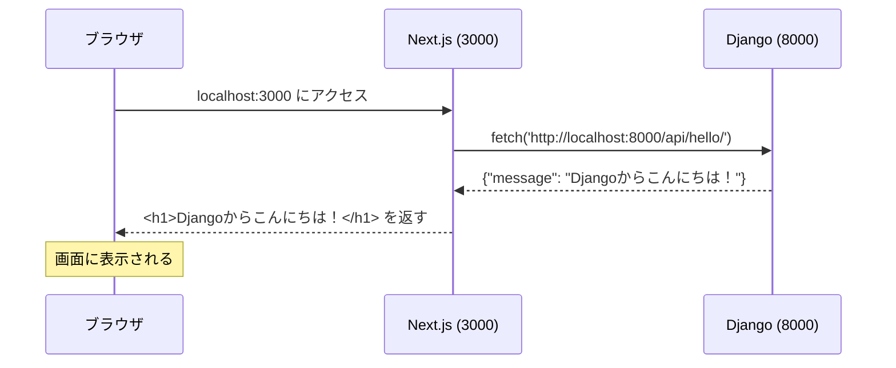

# Chapter 3：はじめての全通

この章の目的は、DjangoとNext.jsを実際に起動し、最小限のコードで両者を繋げることです。完成度は低くて構いません。この章が終わる頃には、フロントエンドがバックエンドのAPIを呼び出してデータを表示する状態が、自分の手で動いています。

「全通」とは全層（フロントエンド・バックエンド・DB）が繋がった状態のことです。まず全体をざっと通しておくことで、第II部以降で各層を深く学ぶときに「どこの話をしているか」が常に見えるようになります。

## 3-1 2つのターミナルによる開発

Chapter 2 でDevContainerを起動しました。この章からは、**同じウィンドウ内でターミナルを2つ開いて**開発を進めます。

```
ターミナル1
  → Django を起動 → localhost:8000 でAPIを提供し続ける

ターミナル2
  → Next.js を起動 → localhost:3000 でページを提供し続ける
```

### 「サーバーは起動したまま」という概念

DjangoやNext.jsのサーバーは、起動したら**そのまま動き続けます**。コマンドを実行するたびに起動するのではなく、1度起動したら開発中はずっと立ち上げたままにします。

ファイルを変更するとサーバーが自動で再読み込みします。ブラウザをリロードするだけで変更が反映されます。終了するときは `Ctrl+C` でサーバーを停止します。

## 3-2 Djangoの起動と確認

### 🛠️ `python manage.py runserver` を実行する

ターミナル1で以下を実行します。

```bash
cd /workspace/backend
python manage.py runserver 0.0.0.0:8000
```

> **DevContainerの方へ**：`0.0.0.0:8000` を指定することで、コンテナの外（ホストのブラウザ）からアクセスできるようになります。`0.0.0.0` はコンテナ内のすべてのネットワークインターフェースで待ち受けるという意味です。

成功すると次のようなメッセージが表示されます。

```
Watching for file changes with StatReloader
Performing system checks...

System check identified no issues (0 silenced).
Django version 5.x.x, using settings 'config.settings'
Starting development server at http://0.0.0.0:8000/
Quit the server with CONTROL-C.
```

`Starting development server at http://0.0.0.0:8000/` が表示されれば起動成功です。このターミナルはそのままにしておきます。

> **補足**：起動ログに `http://0.0.0.0:8000/` と表示されますが、このURLはブラウザでは開けません。ブラウザでアクセスするときは `http://localhost:8000/` を使います。

### 🛠️ ブラウザでアクセスして確認する

ブラウザで `http://localhost:8000/` を開きます。

Djangoのロケット画面（"The install worked successfully! Congratulations!" というページ）が表示されれば、Djangoは正常に動いています。

## 3-3 Next.jsの起動と確認

### 🛠️ `npm run dev` を実行する

ターミナルパネル右上の **＋** ボタンで新しいターミナル（ターミナル2）を開き、以下を実行します。

```bash
cd /workspace/frontend
npm run dev
```

成功すると次のようなメッセージが表示されます。

```
  ▲ Next.js 15.x.x
  - Local:        http://localhost:3000

 ✓ Starting...
 ✓ Ready in 1234ms
```

このターミナルもそのままにしておきます。

### 🛠️ ブラウザでアクセスして確認する

ブラウザで `http://localhost:3000/` を開きます。

Next.jsのデフォルトページが表示されれば、Next.jsは正常に動いています。

これで2つのサーバーが同時に起動した状態になりました。

## 3-4 DjangoからNext.jsへのデータ表示

DjangoとNext.jsが別々に動くことを確認できたので、次は2つを繋げます。Djangoにシンプルなデータを返すAPIを作り、Next.jsからそれを呼び出して画面に表示します。

### 🛠️ `library` アプリを作成する

Djangoプロジェクトは「プロジェクト」と「アプリ」の2層構造になっています。`config/` がプロジェクト（設定の中心）で、機能ごとのコードは**アプリ**に書きます。今から作る `library` アプリが、この本で開発するアプリケーション本体です。

ターミナル1で新しいターミナルを開かず、Djangoサーバーを `Ctrl+C` で一時停止してから以下を実行します。

```bash
python manage.py startapp library  # startapp はアプリの雛形ディレクトリを生成するコマンド
```

実行すると `backend/library/` ディレクトリが作成されます。

```
backend/
├── library/           ← 今作成された
│   ├── views.py       ← リクエストを処理する関数を書く場所
│   ├── models.py      ← データベースの構造を定義する場所（Chapter 5で使う）
│   └── ...
└── config/
```

アプリを作成したら、Djangoサーバーを再起動します。

```bash
python manage.py runserver 0.0.0.0:8000
```

### 🛠️ DjangoにAPIエンドポイントを作る

`backend/library/views.py` を開いて、以下のように編集します。

```python
from django.http import JsonResponse  # from〜importは他のファイルから機能を読み込む書き方

def hello(request):  # defは関数の定義。処理に名前をつけてまとめる
    return JsonResponse({"message": "Djangoからこんにちは！"})  # returnはこの関数が返す値を指定する
```

次に、`backend/config/urls.py` を開いて、このビューへのURLを登録します。

```python
from django.contrib import admin
from django.urls import path
from library import views  # libraryアプリのviewsモジュールを読み込む

urlpatterns = [
    path('admin/', admin.site.urls),
    path('api/hello/', views.hello),  # /api/hello/ へのリクエストをhello関数に渡す
]
```

ファイルを保存すると、ターミナル1にDjangoが自動で再読み込みしたログが流れます。

**動作確認：** ブラウザで `http://localhost:8000/api/hello/` を開きます。

```json
{"message": "Djangoからこんにちは！"}
```

このようなJSONが表示されれば成功です。バックエンドのAPIが正しく動いています。

### 🛠️ Next.jsから呼び出して画面に表示する

`frontend/src/app/page.tsx` を開いて、以下のように書き換えます。

```tsx
export default async function Home() {
  // export default: このファイルの主要な関数として外部に公開する
  // async: 非同期処理（APIの呼び出し等）を含む関数の宣言

  const res = await fetch('http://localhost:8000/api/hello/')
  // const: 再代入しない変数の宣言
  // await: 非同期処理の完了を待ってから次の行に進む
  // DjangoとNext.jsは同じコンテナ内で動いているため、localhostで通信できる

  const data = await res.json()
  // res.json() はレスポンスのボディをJavaScriptのオブジェクトに変換する

  return (
    <main>
      <h1>{data.message}</h1>
      {/* JSXでは {} の中にJavaScriptの値を埋め込める */}
    </main>
  )
}
```

ファイルを保存します。

**動作確認：** ブラウザで `http://localhost:3000/` を開きます（すでに開いている場合はリロードします）。

```
Djangoからこんにちは！
```

画面にこのテキストが表示されれば成功です。

### 全層が繋がった状態の確認

今何が起きているかを整理しましょう。



1. ブラウザが `localhost:3000` にアクセスする
2. Next.jsがサーバー側で `localhost:8000/api/hello/` へfetchを送る
3. Djangoが `{"message": "Djangoからこんにちは！"}` を返す
4. Next.jsがそのデータをHTMLに埋め込んでブラウザに返す
5. ブラウザにメッセージが表示される

これが本書で作るシステムの基本的な流れです。Chapter 3 では中身が最小限ですが、この「全層が繋がった状態」を早い段階で体験することに意味があります。

> **Next.jsのServer Component**：今回 `page.tsx` に書いた `fetch` はブラウザではなくNext.jsのサーバー側で実行されます。そのため、ブラウザとDjango間のCORSの問題が発生しません（CORSについてはChapter 8で詳しく説明します）。

### この後何を深めるかの見通し

Chapter 3 の段階で作ったものはきわめてシンプルです。第II部では各層を本格的に作り込んでいきます。

| 現時点での課題 | 対応する章 |
|-------------|---------|
| データベースを使っていない | Chapter 5（モデル定義） |
| APIが1つしかなく機能もない | Chapter 6（REST API全般） |
| 画面がほぼない | Chapter 7（Next.js基礎） |
| CORS設定をしていない | Chapter 8（フロント・バック接続） |
| 認証がない | Chapter 10（JWT認証） |

今は動くことを確認できれば十分です。「なぜこう書くのか」は後の章で理解できます。

## まとめ

- 1つのDevContainer内でターミナルを2つ開き、DjangoとNext.jsをそれぞれ起動した
- フロントエンド（Next.js）→ バックエンド（Django）→ レスポンスという全層の流れを最小限の形で体験した
- 第II部で各層を深く学ぶための起点ができた

---

次の章から第II部に入ります。まずバックエンドのDjangoを深く理解するところから始めます。
