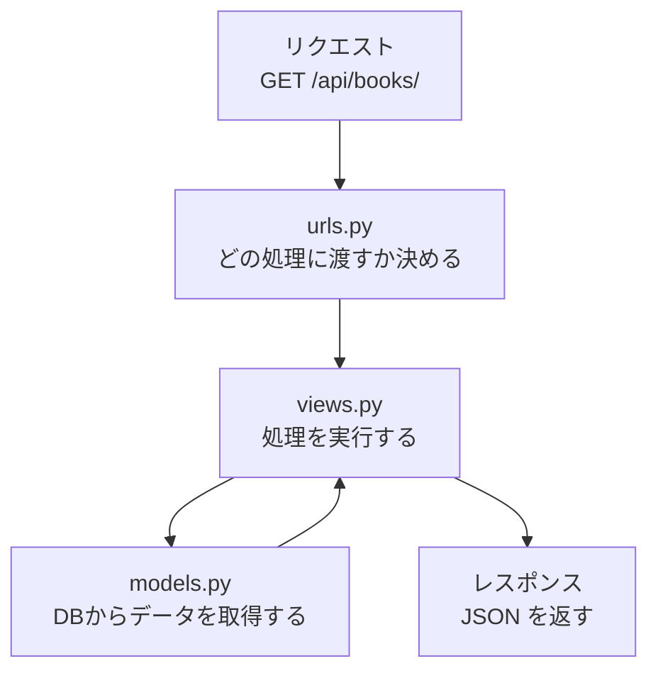

# Chapter 4：PythonとDjango基礎

第II部ではいよいよ本格的な実装に入ります。Chapter 4〜6は `backend/` だけを触います。

この章では、Djangoのプロジェクト構造と設定ファイルの読み方を理解します。コードを書く前に「ファイルがどこにあって何をしているか」を把握しておくと、エラーが起きたときに原因を探しやすくなります。

## 4-1 Djangoのプロジェクト構造

### プロジェクトとアプリの違い

Djangoには「プロジェクト」と「アプリ」という2つの概念があります。

**プロジェクト**はシステム全体の入れ物です。設定ファイルやURLの定義など、システム全体に関わるものが置かれます。本書では `config/` ディレクトリがプロジェクトに当たります。

**アプリ**は機能のまとまりです。1つのプロジェクトの中に複数のアプリを置けます。本書では図書館の貸出機能をまとめた `library/` がアプリです。

```
backend/
├── manage.py           ← Djangoの管理コマンド（runserver / migrate 等）を実行するファイル
├── requirements.txt    ← 使用するPythonライブラリの一覧
├── config/             ← プロジェクト（システム全体の設定）
│   ├── __init__.py
│   ├── settings.py     ← 設定ファイル
│   ├── urls.py         ← URLの定義（どのURLをどの処理に渡すか）
│   └── wsgi.py         ← 本番環境向けのサーバー設定
└── library/            ← アプリ（図書館機能のまとまり）
    ├── __init__.py
    ├── admin.py        ← 管理画面の設定
    ├── apps.py         ← アプリの設定
    ├── models.py       ← データベースのテーブル定義
    ├── tests.py        ← テストコード
    └── views.py        ← リクエストを受けて処理する関数
```

分割する理由は責務の分離です。「設定」「URLルーティング」「データ定義」「処理ロジック」をそれぞれ別のファイルに置くことで、どこに何を書くかが明確になります。

### 主要ファイルの役割

**`manage.py`** はDjangoの「何でも屋ツール」です。サーバーの起動・データベースの操作・テストの実行など、開発中に使うコマンドはすべてこのファイルを通して実行します。Chapter 3で使った `python manage.py runserver` や、後の章で使う `python manage.py migrate` などがその例です。

**`config/settings.py`** はシステム全体の設定ファイルです。データベースの接続先、インストールされているアプリ一覧、デバッグモードのオン/オフなどを定義します。次の節で詳しく読みます。

**`config/urls.py`** はURLのルーティングを定義するファイルです。「`/api/books/` へのリクエストは `BookViewSet` に渡す」のような対応をここで設定します。

**`library/models.py`** はデータベースのテーブル構造をPythonのクラスとして定義するファイルです。Chapter 5で本格的に使います。

**`library/views.py`** はリクエストを受け取り、処理してレスポンスを返す関数（またはクラス）を書くファイルです。Chapter 3では `hello()` という関数をここに書きました。

### リクエストがDjangoに届いてから返るまでの流れ

ブラウザや Next.js から `GET /api/books/` というリクエストが来たとき、Django の中ではこのような順番で処理が進みます。



1. **urls.py** がURLのパターンを照合して、対応するviewに処理を渡す
2. **views.py** のview（関数またはクラス）がリクエストを受け取り処理する
3. 必要に応じて **models.py** 経由でデータベースを読み書きする
4. 処理結果をレスポンスとして返す

Chapter 6でDjango REST Frameworkを使うと、この流れに「Serializerによるデータ変換」が加わります。

## 4-2 settings.pyの読み方

`backend/config/settings.py` を開きましょう。初めて見ると項目が多くて圧倒されますが、よく触れる箇所は限られています。

### INSTALLED_APPS

```python
INSTALLED_APPS = [
    'django.contrib.admin',      # 管理画面
    'django.contrib.auth',       # 認証機能（ユーザー管理）
    'django.contrib.contenttypes',
    'django.contrib.sessions',
    'django.contrib.messages',
    'django.contrib.staticfiles',
    # 追加するアプリはここに書く
    'library',                   # 自分たちのアプリ
]
```

`INSTALLED_APPS` はDjangoが認識するアプリの一覧です。新しいアプリを作ったときや、外部ライブラリ（後の章で追加する `rest_framework` や `corsheaders`）を使うときは、ここに追加します。登録し忘れると「そのアプリは知らない」というエラーになるため、ライブラリを追加するたびに確認する習慣をつけておきましょう。

### DATABASES

```python
DATABASES = {
    'default': {
        'ENGINE': 'django.db.backends.mysql',  # 使用するDBの種類
        'NAME': 'library',                      # データベース名
        'USER': 'root',                         # ユーザー名
        'PASSWORD': 'password',                 # パスワード
        'HOST': 'db',                           # ホスト名（docker-composeのサービス名）
        'PORT': '3306',                         # ポート番号
    }
}
```

`DATABASES` はデータベースの接続設定です。`HOST` が `db` になっているのは、docker-compose.yml でMySQLのサービス名を `db` と定義しているためです（Chapter 2で確認しました）。

パスワードなどの機密情報は本来、設定ファイルに直接書かず環境変数で管理します。Chapter 8で詳しく扱います。

### その他重要な設定項目

```python
SECRET_KEY = 'django-insecure-xxxx...'
```

`SECRET_KEY` はセッションやトークンの生成に使われる秘密の文字列です。本番環境では外部に漏れないよう厳重に管理します（Chapter 14で扱います）。

```python
DEBUG = True
```

`DEBUG = True` の間は、エラーが起きたときに詳細なスタックトレース（どのファイルの何行目でエラーが起きたかの情報）がブラウザに表示されます。開発中は便利ですが、本番環境では必ず `False` にします。

```python
ALLOWED_HOSTS = []
```

`ALLOWED_HOSTS` はDjangoがレスポンスを返すことを許可するホスト名の一覧です。`DEBUG = True` の間は空でも動きますが、本番環境では実際のドメインを指定します。

```python
LANGUAGE_CODE = 'ja'
TIME_ZONE = 'Asia/Tokyo'
```

日本語・日本時間に設定しておくと、管理画面の表示やログの日時が日本時間になります。

## まとめ

- Djangoはプロジェクト（全体の設定）とアプリ（機能のまとまり）に分かれていることを理解した
- `urls.py → views.py → models.py` という処理の流れを理解した
- `settings.py` の `INSTALLED_APPS`・`DATABASES`・`DEBUG` 等の主要な設定項目を読めるようになった

---

次の章では、MySQLのテーブル設計を行い、Djangoモデルとして実装します。
