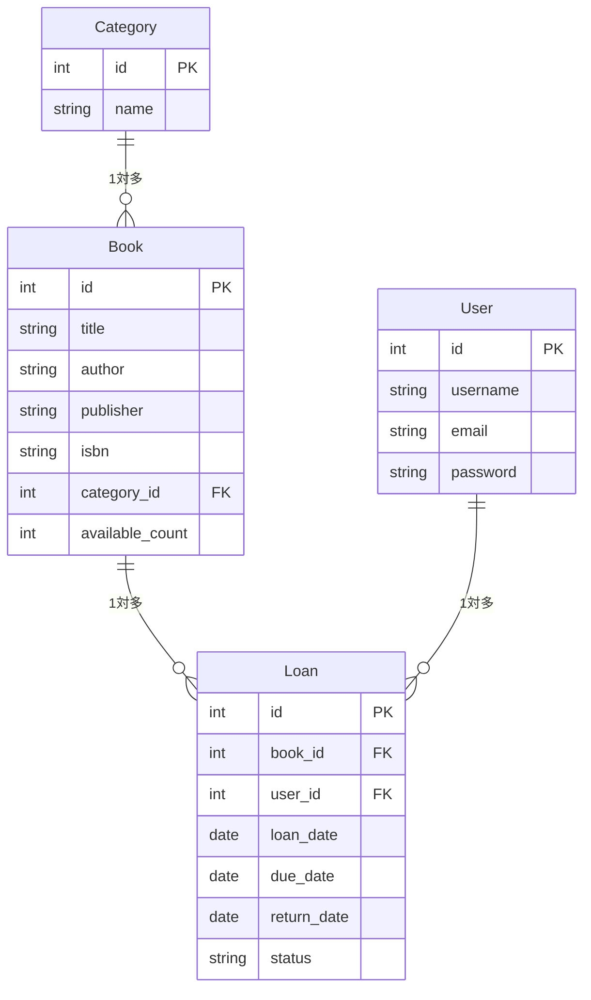

# Chapter 5：データベース設計とDjangoモデル

この章では、図書館貸出システムのデータベースを設計し、Djangoのモデルとして実装します。「何をテーブルにするか」という設計の考え方から、MySQLへの接続、マイグレーション、ORMによる操作まで一通り体験します。

## 5-1 リレーショナルDBの基本概念

### テーブル・レコード・カラム

リレーショナルデータベース（RDB）はデータを**テーブル**（表）の形で管理します。

```
Bookテーブル
+----+----------------------------------+--------+------------------+
| id | title                            | author | isbn             |
+----+----------------------------------+--------+------------------+
|  1 | 実践フルスタックWeb開発ワークショップ | 山田太郎 | 978-4-00-000001-0 |
|  2 | データベース設計入門               | 鈴木花子 | 978-4-00-000002-0 |
+----+----------------------------------+--------+------------------+
```

- **テーブル**：種類ごとのデータの入れ物（本テーブル、ユーザーテーブル等）
- **レコード**：1行分のデータ（1冊の本）
- **カラム**：各列の項目（id、タイトル、著者等）

### 主キーと外部キー

**主キー**（Primary Key）は各レコードを一意に識別するカラムです。Djangoでは `id` が自動で主キーとして設定されます。

**外部キー**（Foreign Key）は別のテーブルの主キーを参照するカラムです。「この貸出は本IDが2の本に対するもの」という関係を表現します。

```
Loanテーブル
+----+---------+---------+------------+
| id | book_id | user_id | loan_date  |
+----+---------+---------+------------+
|  1 |       2 |       5 | 2026-05-01 |   ← book_idはBookテーブルのidを参照
+----+---------+---------+------------+
```

### リレーション（1対多）

外部キーによってテーブル間に**リレーション**（関係）が生まれます。本書では主に**1対多**の関係を使います。

- 1つのカテゴリに複数の本が属する（Category 1対多 Book）
- 1冊の本に複数の貸出履歴がある（Book 1対多 Loan）
- 1人のユーザーが複数の貸出をする（User 1対多 Loan）

## 5-2 図書館システムのテーブル設計

### 何をテーブルにするかの考え方

「名詞」がテーブルの候補になります。図書館システムで登場する名詞を洗い出すと、本・カテゴリ・ユーザー・貸出が挙がります。

次に「それぞれが持つべき情報（カラム）」を考えます。

### ER図の読み方・書き方

ER図（Entity-Relationship図）はテーブル間の関係を表す設計図です。



### Book / Category / Loan / User の設計

| テーブル | 主なカラム | 備考 |
|---------|---------|------|
| User | id / username / email / password | Djangoの組み込みUserモデルをそのまま使う |
| Category | id / name | 本のジャンル分類 |
| Book | id / title / author / publisher / isbn / category_id / available_count | available_countは貸出可能冊数 |
| Loan | id / book_id / user_id / loan_date / due_date / return_date / status | statusは「貸出中 / 返却済み」 |

`User` はDjangoが標準で提供するモデルを使うため、自分で定義する必要はありません。

## 5-3 MySQLとDjangoの接続

### 🛠️ settings.pyのDATABASESを設定する

`backend/config/settings.py` の `DATABASES` を以下のように設定します。

```python
DATABASES = {
    'default': {
        'ENGINE': 'django.db.backends.mysql',
        'NAME': 'library',
        'USER': 'root',
        'PASSWORD': 'password',
        'HOST': 'db',      # docker-composeのサービス名
        'PORT': '3306',
    }
}
```

`HOST` に `db` と書くのは、docker-compose.yml でMySQLサービスに `db` という名前をつけているためです。同じdocker-compose内のサービスはサービス名でアクセスできます。

### 🛠️ mysqlclientをインストールする

PythonからMySQLに接続するには `mysqlclient` ライブラリが必要です。`requirements.txt` に追加してインストールします。

```bash
# requirements.txtに追記する（エディタで開いて追加してもよい）
echo "mysqlclient" >> requirements.txt

# インストールする
pip install mysqlclient
```

### 🛠️ 接続を確認する

マイグレーションコマンドを実行して接続が成功するか確認します。

```bash
python manage.py migrate
```

以下のような出力が流れ、最後に `Applying ...OK` が続けば接続成功です。

```
Operations to perform:
  Apply all migrations: admin, auth, contenttypes, sessions
Running migrations:
  Applying contenttypes.0001_initial... OK
  Applying auth.0001_initial... OK
  ...
```

エラーが出た場合は `DATABASES` の設定（特に `HOST` と `PASSWORD`）を見直してください。

## 5-4 Djangoモデルの定義

### フィールドの種類

Djangoモデルのカラムは「フィールド」として定義します。よく使うフィールドを覚えておきましょう。

| フィールド | 対応するDBの型 | 用途 |
|-----------|-------------|------|
| `CharField(max_length=n)` | VARCHAR | 文字列（上限あり） |
| `TextField()` | TEXT | 長いテキスト |
| `IntegerField()` | INT | 整数 |
| `BooleanField()` | TINYINT | True / False |
| `DateField()` | DATE | 日付 |
| `DateTimeField()` | DATETIME | 日時 |
| `ForeignKey()` | INT（外部キー） | 他テーブルへの参照 |

### 🛠️ Book / Category / Loan モデルを定義する

`backend/library/models.py` を以下のように編集します。

```python
from django.db import models
from django.contrib.auth.models import User  # Djangoの組み込みUserモデルを使う


class Category(models.Model):  # classはクラスの定義。models.Modelを継承してDjangoモデルになる
    name = models.CharField(max_length=100)

    def __str__(self):  # __str__はオブジェクトを文字列で表したときの表示を定義する
        return self.name  # selfはこのオブジェクト自身を指す


class Book(models.Model):
    title = models.CharField(max_length=200)
    author = models.CharField(max_length=100)
    publisher = models.CharField(max_length=100)
    isbn = models.CharField(max_length=13, unique=True)  # unique=Trueは重複を禁止する
    category = models.ForeignKey(
        Category,
        on_delete=models.SET_NULL,  # カテゴリ削除時にこのカラムをNULLにする
        null=True,   # DBでNULLを許可する
        blank=True,  # フォームで空欄を許可する
    )
    available_count = models.IntegerField(default=1)  # default=1は未指定時の初期値

    def __str__(self):
        return self.title


class Loan(models.Model):
    STATUS_CHOICES = [  # 選択肢を定数として定義する
        ('active', '貸出中'),
        ('returned', '返却済み'),
    ]

    book = models.ForeignKey(Book, on_delete=models.CASCADE)  # CASCADE: 本が削除されたら貸出も削除
    user = models.ForeignKey(User, on_delete=models.CASCADE)
    loan_date = models.DateField(auto_now_add=True)  # auto_now_add=True: 作成時に自動で今日の日付を入れる
    due_date = models.DateField()
    return_date = models.DateField(null=True, blank=True)
    status = models.CharField(max_length=20, choices=STATUS_CHOICES, default='active')

    def __str__(self):
        return f"{self.user.username} - {self.book.title}"
```

### 🛠️ ForeignKeyでリレーションを定義する

`ForeignKey` の第2引数 `on_delete` は、参照先のレコードが削除されたときの挙動を指定します。

| 値 | 挙動 |
|----|------|
| `CASCADE` | 参照先の削除に合わせてこのレコードも削除する |
| `SET_NULL` | 参照先が削除されたらこのカラムを NULL にする |
| `PROTECT` | 参照先が削除されないように保護する |

本書では、本が削除されたら関連する貸出履歴も削除される `CASCADE`、カテゴリが削除されても本は残す `SET_NULL` を使い分けています。

## 5-5 マイグレーション

### マイグレーションとは何か・なぜ必要か

Pythonでモデルを定義しただけでは、データベースのテーブルはまだ作られていません。モデルの定義をデータベースに反映する操作を**マイグレーション**といいます。

2段階のコマンドで実行します。

1. `makemigrations` ：モデルの変更を検出して「マイグレーションファイル」を生成する
2. `migrate` ：マイグレーションファイルをDBに適用してテーブルを作成・変更する

なぜ2段階に分かれているかというと、マイグレーションファイルはGitで管理できるからです。「いつ誰がどのようにテーブル定義を変えたか」を履歴として残せます。

### 🛠️ `makemigrations` を実行する

```bash
python manage.py makemigrations
```

```
Migrations for 'library':
  library/migrations/0001_initial.py
    - Create model Category
    - Create model Book
    - Create model Loan
```

`library/migrations/0001_initial.py` というファイルが生成されました。

### 🛠️ `migrate` を実行する

```bash
python manage.py migrate
```

```
Operations to perform:
  Apply all migrations: admin, auth, contenttypes, library, sessions
Running migrations:
  Applying library.0001_initial... OK
```

`Applying library.0001_initial... OK` が表示されれば、テーブルが作成されています。

### マイグレーションファイルの中身の読み方

生成された `library/migrations/0001_initial.py` を開いてみましょう。

```python
class Migration(migrations.Migration):
    operations = [
        migrations.CreateModel(
            name='Category',
            fields=[
                ('id', models.BigAutoField(...)),  # 自動生成される主キー
                ('name', models.CharField(max_length=100)),
            ],
        ),
        migrations.CreateModel(
            name='Book',
            fields=[
                ...
            ],
        ),
    ]
```

このファイルは自動生成されるものなので、基本的に手動で編集する必要はありません。ただし、後でモデルを変更した際（カラムを追加・削除・変更した場合）は再度 `makemigrations` を実行して新しいマイグレーションファイルを生成します。

## 5-6 ORMによるデータ操作

ORM（Object-Relational Mapping）はSQLを書かずにPythonのコードでデータベースを操作できる仕組みです。DjangoのORMを使うと、複雑なSQLを意識せずにデータの作成・取得・更新・削除ができます。

### 🛠️ Djangoシェルを起動する

Djangoシェルはブラウザを通さずにDjangoのコードを直接試せる対話型の実行環境です。

```bash
python manage.py shell
```

```
Python 3.12.x
Type "help", "copyright", "credits" or "license" for more information.
(InteractiveConsole)
>>>
```

シェルが起動したら以下の操作を試してみましょう。終了するときは `exit()` と入力します。

### 🛠️ データを作成する（create）

```python
>>> from library.models import Category, Book

# カテゴリを作成する
>>> category = Category.objects.create(name="プログラミング")
>>> category.id
1
>>> category.name
'プログラミング'

# 本を作成する
>>> book = Book.objects.create(
...     title="実践フルスタックWeb開発ワークショップ",
...     author="山田太郎",
...     publisher="技術出版社",
...     isbn="9784000000010",
...     category=category,
...     available_count=3,
... )
```

### 🛠️ データを取得する（get / filter）

```python
# 全件取得する
>>> Book.objects.all()
<QuerySet [<Book: 実践フルスタックWeb開発ワークショップ>]>

# 条件で1件取得する（存在しない場合は例外が発生する）
>>> Book.objects.get(id=1)
<Book: 実践フルスタックWeb開発ワークショップ>

# 条件で複数件取得する
>>> Book.objects.filter(category=category)
<QuerySet [<Book: 実践フルスタックWeb開発ワークショップ>]>
```

`get()` と `filter()` の違いは、`get()` は必ず1件を返し（0件や2件以上だとエラー）、`filter()` は0件以上のQuerySetを返す点です。

### 🛠️ データを更新する（save）

```python
>>> book = Book.objects.get(id=1)
>>> book.available_count = 5
>>> book.save()  # saveを呼ぶまでDBには反映されない
>>> Book.objects.get(id=1).available_count
5
```

### 🛠️ データを削除する（delete）

```python
>>> book = Book.objects.get(id=1)
>>> book.delete()
(1, {'library.Book': 1})
```

### 🛠️ フィルタリング・並び替えを試す

```python
# タイトルに"Python"を含む本を検索する
>>> Book.objects.filter(title__contains="Python")

# available_countが1以上の本を取得する
>>> Book.objects.filter(available_count__gte=1)

# タイトルの昇順で並び替える
>>> Book.objects.all().order_by('title')

# 作成日の降順（最新順）で並び替える
>>> Book.objects.all().order_by('-id')
```

`filter()` の引数でよく使うルックアップは次のとおりです。

| 記法 | 意味 | 例 |
|------|------|-----|
| `__contains` | 部分一致 | `title__contains="Python"` |
| `__exact` | 完全一致（省略可） | `status__exact="active"` |
| `__gte` | 以上 | `available_count__gte=1` |
| `__lte` | 以下 | `available_count__lte=3` |
| `__isnull` | NULLかどうか | `return_date__isnull=True` |

## 5-7 Django管理画面によるデータ確認

Djangoには管理画面が標準で付属しています。本書では「機能として作り込む」のではなく、開発中にデータを確認・修正するためのツールとして活用します。

### 🛠️ スーパーユーザーを作成する

管理画面にログインするためのスーパーユーザーを作成します。

```bash
python manage.py createsuperuser
```

```
Username: admin
Email address: admin@example.com
Password: （任意のパスワードを入力する）
Password (again): （同じパスワードを入力する）
Superuser created successfully.
```

### 🛠️ モデルをadminに登録する

`backend/library/admin.py` を以下のように編集します。

```python
from django.contrib import admin
from .models import Category, Book, Loan

admin.site.register(Category)
admin.site.register(Book)
admin.site.register(Loan)
```

### 🛠️ 管理画面でデータを確認する

Djangoを起動した状態で `http://localhost:8000/admin/` にアクセスします。先ほど作成したスーパーユーザーでログインすると、Category・Book・Loan の一覧・追加・編集画面が使えます。

ORMで作成したデータが表示されているか確認しましょう。

開発中にデータを直接確認したり、テスト用のデータを素早く入れたりするのに便利です。ただし本番環境ではアクセスを制限するか、用途を限定して使いましょう。

### データ確認ツールとしての位置づけ

本書ではDjango管理画面をこのまま使い続けることはせず、Chapter 6 以降ではREST APIを通じてフロントエンドからデータを操作します。管理画面はあくまで「開発中にデータを覗き見るツール」として使います。

## まとめ

- リレーショナルDBの基本概念（テーブル・主キー・外部キー・1対多）を理解した
- 図書館システムのER図を設計し、Category / Book / Loan モデルとして定義した
- マイグレーションでモデル定義をMySQLに反映した
- DjangoシェルでORMによるデータの作成・取得・更新・削除を実行した
- Django管理画面をデータ確認ツールとして活用できるようになった

---

次の章では、このモデルをもとにREST APIを実装します。
